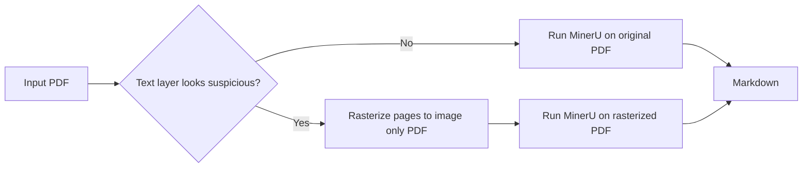
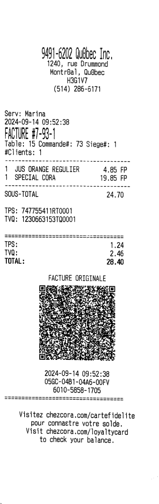

# Architecture

## Parsing Pipeline

## Examples

| MinerU | Ours |
| --- | --- |
| Serv^ Marina    2024-09-14 09:52:38    [ا    ĩable: 15 Commande#: 73 Siege#: 1    #Clients: 1  1 JUS ORANGE REGULER 4.85 FP   1 SPECIAE CORA 19.85 FP  SOUS-TOTAL  24.70  TPS: 747755411RT0001   TVQ: 1230653153TQ0001   TPS: 1.24   TVQ; 2.45   TOTAL: 28.40  FACTURE ORIGINALE  Visitez chezcora.com/cartefidelite pour connaetre votre solde. Visit chezcora.com/loya1tycard to check your balance. | Serv: Marina    2024-09-14 09:52:38    FACTURE #7-93-1    Table: 15 Commande#: 73 Siege#: 1    #Clients: 1    1 JUS ORANGE REGULIER 4.85 FP    1 SPECIAL CORA 19.85 FP  SOUS-TOTAL  24.70  TPS: 747755411RT0001   TVQ: 1230663153TQ0001   TPS: 1.24   TVQ: 2.46   TOTAL: 28.40  FACTURE ORIGINALE  2024-09-14 09:52:38    05GC-04B1-04A6-00FV    6010-5858-1705  Visitez chezcora.com/cartefidelite pour connaetre votre solde. Visit chezcora.com/loyaltycard to check your balance. |
