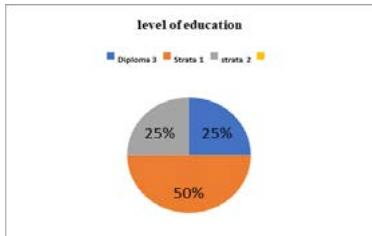
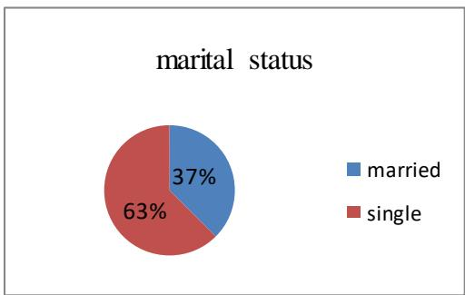
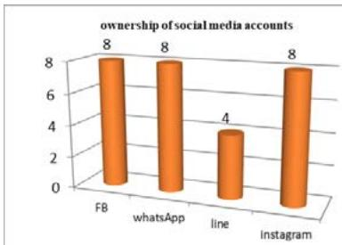
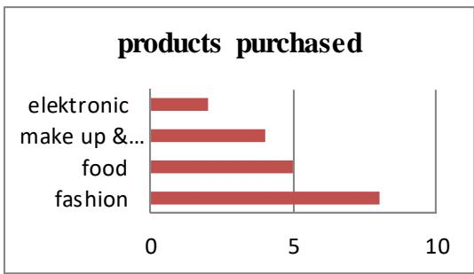
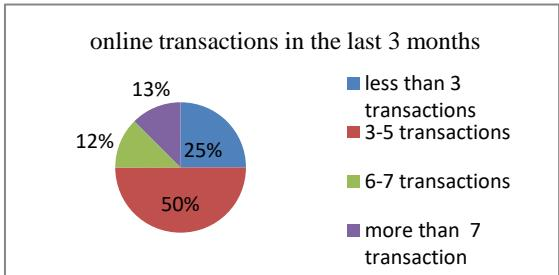

# Women Behavior in Social Media in Fulfillment of Online Shopping Needs

Susi Yunarti Faculty of Communication University of Persada Indonesia (UPI YAI) Jakarta - Indonesia susiyunarti $@$ gmail.com

Wijayanti Faculty of Communication University of Persada Indonesia (UPI YAI) Jakarta - Indonesia

Abstract—-This research is intended to know the behavior of young women in social media in search of product information for the interest of online shopping and motives that encourage the lifestyle of shopping at online shop. Theories used in this research are theory of behavior information seeking also use and gratification theory, the concepts of research are new media, ecommerce and consumer behavior. This research is qualitative. The data were collected using in-depth interviews of 8 young women in Jakarta between the ages of 25-35 years and already working. This research uses phenomenology method and uses source triangulation for data validity. The results showed that there are two groups of consumers are smart online shopping behavior and moderate online shopping behavior.

Keywords—consumer behavior; use and gratification; information seeking behavior; e-commerce; social media

# I. INTRODUCTION

Online shopping trends hit almost everyone, men, women, teens or adults. There are those who feel satisfied, some feel helpful and get the ease, there are feeling filled with taste and needs, but no less also feel cheated and harmed, some feel quite complicated and troublesome, less fulfilled taste and desire so feel less satisfied when shopping by online. Further develop the behavior of consumers in making use of this online shopping application and satisfied the desire to spend and fulfilled what is his needs. Online shopping, although in the process, there are many conveniences and is considered very helpful for some people but not without risk, there is a need to be considered by consumers where we must be careful and meticulous before buying in order not to lose. Although information and reviews about a product have been delivered and explained in a specific and good way, it is not a guarantee that we will get a product that matches what is expected. As a result, we can lose and be deceived what else related to shipping costs and taxes that are not all borne by the seller but by the buyer itself. And the unclear regulations or rules on online shopping by the government. On the basis of this, it is interesting to analyze more deeply how the behavior of consumers, especially young women in Jakarta, especially in meeting the desires and needs by shopping online. This research focuses on the behavior of young female consumers in online shopping through social media. Research question: (1) How young women behave in social media in search of product information for online shopping needs. (2) What is the motive that encourages young women to develop lifestyles, shop at online shop.

# II. LITERATURE REVIEW

# A. Previous Research

Search research [1] that social media networking became a popular business marketing strategy for most people. Following the fame of social media, Instagram join and become a trend since 2010 as well as a marketing tool that is quite profitable because there is interaction with consumers. Through instagram market players can share photos and videos with consumers and they can provide comments or even exchange information relating to marketed products. Even consumers can give a mark like, as feedback. [1]

Irfan's research stated that there are many factors that confuse the company in mapping the target consumer behavior. This research seeks describes the factors that influence the behavior of consumer transactions in social media. The method used is qualitative which involves as many as 5 people with characters have often done shopping transactions through social media. Technique of data retrieval is done by observation and structured interview. The results showed there are three factors that influence consumer behavior in social media. the first cultural factors such as between the suitability of language between consumers with sellers, social factors such as testimonials, offers from friends, the way sellers describe the product. Second, personal factors such as ease of shopping. The three psychological factors such as discount, delivery time, and product packaging. [2]

# B. Theoretical Review

New media according to Liliweri is a concept that explains the capabilities of media that with the support of digital devices can access content anytime, anywhere so as to provide an opportunity for anyone, either as a recipient / user to participate actively, interactively, and creatively to give feedback of the messages that in turn form a new community / community through the media content. Another important aspect of new media is real time based. New media give birth to social media like facebook, instagram, line, whatsApp, youtube is now a mainstay for all circles who want to market their products and for consumers who are going to make purchases because social media gives a lot of information about various products for all the needs that can be purchased online, formed and grew as Ecommerce as well as being a part of people's lives [3, p. 284].

While Kaplan is a means of interaction between a number of people through 'sharing' information and ideas through the Internet network to form a kind of virtual community. social media is a group of internet-based applications formed based on ideology and web 2.0 technologies that enable people to be mobile, able to create and exchange content called usergenerated content [3, p. 288].

Before consumers decide to buy a product, it will first conduct an evaluation to process the information. According Shimp [4, p. 118] there are several stages in the processing of information, namely (1) exposure to information, is the consumer gets the message of marketing through the media, (2) selective attention, is consumers only follow a small part of the messages obtained, by selecting messages that are interesting and relevant to the destination, (3) comprehension of attended information, understands the meaning of the information seen or noticed, (4) agreement with comprehended information, is consumer approval of messages that have been understood, (5) retention in memory of accepted information, is a process where the message as a stimulus is processed in the memory of the senses as short-term memory and then stored in long-term memory for the necessary time can be recalled, and (6) retrieval of information from memory, is a process of recalling the necessary information from long-term memory after the consumer has received other new information or for decisionmaking before purchasing.

The American marketing association defines consumer behavior as the dynamics of the interaction between influence and awareness, behavior and the environment in which humans exchanged aspects of life [5, p. 3]. This definition is similar to the statement of Varey [6, p. 42] that consumer behavior is what people do as consumers as they seek to live their lives, including exchanging some things for value products or services that satisfy their needs, this includes processes of browsing (e.g. ‘window-shopping’, reading magazines, watching television, and now by social media) and selection, purchase, use, evaluation and influencing others, and disposal. There are two sides to the consumer behavior coin: (a) Consumers decide how to spend their time and money to buy and consume products and services that satisfy their own recognized needs (response to hunger, love, vanity, fear, identity, recognition, insecurity, stimulation, etc.). (b) ’Marketers’1 offer products and services so that consumers will buy from them, thus satisfying consumer needs for money, which, in turn, satisfies their own needs.

All consumers are motivated to meet their needs according to their expectations and desires. Each individual search for a product they want, chooses one that they believe can satisfy their needs and uses it, they also evaluate so that the next action is if they are disappointed they do not purchase the product in the future but if they are satisfied will do re-purchase even recommend on his friends and relatives.

The idea that media utilization depends heavily on satisfying needs or motivational expectations from an audience's perspective is still relevant today. Communities are often driven on the basis of common needs and interests. Most of it comes from the will to fulfill the psychological needs. Some of these needs, among others, are for the purpose of obtaining information, relaxation, familiarity and for diversion.

In accordance with the basic assumption of using and gratification theory, that (1) media and content choice is generally rational and directed toward certain specific goals and satisfaction (thus the audience is active and audience formation can be logically explained), (2) audience members are conscious of the media–related needs which arise in personal (individual) and social (shared) circumstances and can voice these in term of motivations, (3) broadly speaking, personal utility is a more significant determinant of audience formation than aesthetic or cultural factors, (4) all of the most of relevant factors for audience formation (motives, perceived or obtained satisfactions, media choices, back ground variables) can, in principle, be measured [7, p. 387].

In general, the utilization of the media, an individual is largely determined by the combination of perceptions of acquired satisfaction and the magnitude of value to obtain such satisfaction. At this time, the growth of new media is very fast as if anesthetize people to develop life style needs. Convergence of media has an impact on people's lives. The emergence of new media supported the current technological developments make life easier for people, especially to gain satisfaction on the various needs that are owned. New media are rife in life and many people rely on new media for information.

Communities spend more of their time with devices to get information, interact, read news, and find entertainment. All social media is a tool for disseminating product information and providing direction on effective use of products. Not a few people use social media to get information products offered by online stores. This happens because through social media provides a variety of content that allows various circles to interact on a reciprocal basis. As Yusup and Subekti point out that; the data set is processed into data that has meaning for the recipient that describes real events and can be used as a tool for decision making. A system will not work properly without any information. [8, p. 1]

Information today is a major need in life, Case [9, p. 113] describes some of the things that affect information seeking behavior, among others: (1) a person's psychological condition, someone who is worried, will show different information seeking behavior with someone who is happy, (2) demographic, in this case the individual social culture as part of the society in which he lives and operates. The ability of the community accessing the internet will determine how they behave, when search information, (3) the role of a person in society, especially in interpersonal relationships influencing information seeking behavior, (4) the influence of the environment in which the individual lives, and (5)

characteristics of the source of information or media used to search information, which is now a lot and diverse.

# III. METHODOLOGY

This research uses qualitative approach through phenomenology. Qualitative research does not begin with theoretical deduction but starts from the field, that is, empirical facts. Natural processes are allowed to occur without researcher intervention in order to describe the actual situation. Researchers only record, do the reduction, grouping data and describe the information obtained. As Creswell asserts that one nature of qualitative research is to closely observe and interact with research subjects to understand their language and interpretations in the world, so we can say that qualitative research is the background of research with more natural time and places [10, p. 14].

This research uses phenomenology method, where data taking is done through in-depth interviews, digging data naturally with research subject to reveal and understand phenomenon through informant experience in social media utilization to get product information purchased online, through in-depth interviews of 8 young women in Jakarta between the ages of 25-35 years, have been working and making online purchases in the last three months.

# IV. FINDING RESEARCH AND DISCUSSION

# A. Finding Research

Online shop or online store is one of the internet applications that start populist, in its official statement to Liputan6.com, One Data reveals 10 best online store in Indonesia consisting of e-Commerce and marketplace Lazada, Blibli, Tokopedia, Elevania, MatahariMall, Shopee, Bukalapak, Zalora, Qoo10, and Blanja. During the first and second quarters, five e-Commerce with the most unique visitors experienced an average of 97 percent growth. Matahari Mall has the highest growth of 201 percent [11]. Online shop application or online store is proof that online application nowadays has penetrated into various service field using internet technology. The marketplace is an online shopping facilitator who does not have an inventory of his own stuff aka store vendor or market for other stores selling online in the virtual market they provide, while e-commerce is the shop owner and then sells it online.

How to Get the Best Online Shop Application, simply install the application, fill in the customer's data, then start browsing. Find the price according to budget, then transact. Payments are made via online through payment features provided on the online shop application. Through a preinstalled banking application. No need to bother to go to the bank or to the ATM, unless the buyer has no application on the device used. Online application shop itself is very easy to obtain, can be downloaded through Google PlayStore [12]. Trend information seeking first on the internet before deciding which products to buy, to be, an indicator of how information sales over the internet are rising, a survey conducted by Alvara Strategic Research on 1550 respondents in 6 major cities in

April-May 2014 mentions that 41, $1 \%$ said they were looking for price information $_ { ( 6 6 . 6 \% ) }$ and product features $( 6 5 . 8 \% )$ , meaning before they decided to buy they tried to compare the product features and what price they thought gave the highest value for them. The products that consumers buy through the internet are also more diverse, ranging from garment / clothing products, then gadgets and electronics products, as well as tickets (airplanes and performances) or cosmetic equipment. When analyzed further, on average they buy $3 \textrm { - } 4$ types of products their needs through the internet, it seems that Indonesian consumer behavior has started to get used to this online shopping activity [13]. Trends in Consumer Behavior Online Shopping Indonesia 2018 According to iPrice: [14].

Consumers prefer to "stop by" via smartphone, the number of smartphone users, who continue to grow time to times seems in line with the increasing number of online store access from the web and applications. Consumers tend to prefer transact through the desktop because it is considered more convenient and cause confidence in shopping. With access to wider desktop computer screens, consumers can freely view detailed information of the goods they want without having constrained by the limitations of the screen on mobile devices.   
iPrice saw that online shopping rate conversion was the highest on Wednesday, while at the weekend rate conversion decreased until thirty percent. The results of research iPrice is not much different from online shopping behavior research conducted by CNBC. Bank transfers are still the most popular payment method. Although the payment methods offered by local e-commerce are now quite diverse, but of the more than two hundred local e-commerce listed in the i Price list, 94 percent of them still provide inter Bank transfer. In addition, the method of cash on delivery (COD) was also as consumer choice, as evidenced as much as 43 percent of e-commerce is still offering the option.

Results from interview on 8 young women in Jakarta who have made purchases online are shown in the table as follows:

TABLE I. INFORMANTS AGE   

<table><tr><td>Informans Age</td></tr><tr><td>25-27 years 37%</td></tr><tr><td>28-30 years 25%</td></tr><tr><td>31-33 years 25%</td></tr><tr><td></td></tr><tr><td>34-36 years 13%</td></tr></table>

TABLE II. SALARY OF THE INFORMANTS   

<table><tr><td colspan="2">Salary of The Informants (million /month)</td></tr><tr><td>Less than 3.49</td><td>12%</td></tr><tr><td>3.50-4.49</td><td>25%</td></tr><tr><td>4.50-5.49</td><td>38%</td></tr><tr><td>More than 5.50</td><td>25%</td></tr></table>

From the results of the study seen in table 1 and table 2 shows that most informants are women aged 25-35 years this can be understood with the position of those who already have income so they have economic independence. Viewed from the level of informant education can be said that all informants with upper high school education, the majority are undergraduate level there are 4 persons then, 2 persons are past as diploma 3, and there are 2 persons already on level magister.

  
Fig. 1. Level of education

Based on marriage status majority informant stated not married, 3 informants claimed have married and have child.

  
Fig. 2. Marital status

  
Fig. 3. Social media accounts ownership

Activities using social media, all informants stated have social media account Facebook, Instagram, WhatsApp and only 4 informants have Line account. All informants in the last three months have made transactions in a number of online shop like zalora, lazada, JD.id, zilingo and some others.

  
Fig. 4. Products purchased

The products they are looking by online are mostly fashion that includes cosmetics, adult clothing, children's clothing, shoes, bags; foods that include packaged foods, snacks and milk; make up & accessories include powder, lipstick, perfume and accessories of hijab, bracelets, necklaces; while electronic products include printers, HP, watches, and household utensils.

  
Fig. 5. Online transactions in the last three months

Based on the number of transactions it appears that the majority of informants make transactions between 3-5 times. The preferred payment system informants mostly stated use ATM transfers only one person who claimed to have done COD.

# B. Discussion

Online shopping trend is on the rise, so, many stores do online sales and people start liking online shopping. Products sold online are often displayed through social media in such a way as to appeal to consumers. Although the product cannot be touched or tried first. But because of the motivation to always follow the fashion, the influence of advertising and testimonials encourage many women have their own fun in online shopping.

Most informants said they did not have any unpleasant experience related to the purchase through online shop and only 2 people have ever been disappointed that is related to the quality of the purchased product because it is not as expected but after complaining both informants get replacement of product as ordered.

The level of customer satisfaction is the belief of the customer before trying or buying a product that will be the reference standard in assessing the product, in this case in addition, the conformity of the expectations of the informant with the quality received by the customer, is, easy in payment, and timeliness, the ability of online shop explaining product details, product warranty and precision of handling complaints are also elements that are highly considered by informants before online transactions.

The results showed that there were 5 informants including smart consumer shopping online shopping group. This group is very cautious and rational in online shopping, before shopping, searching for product information on social media with care and still more often choose shopping offline. While 3 informants are classified as online shopping behavior because they tend to think less in deciding product purchases, always searching for product information through social media and shopping online is part of their fun.

# V. CONCLUSION

The behavior of young women in Jakarta in the search for product information through social media is part of the motivation to fulfill their needs because it is considered more practical. Shopping online is a new lifestyle that brings a sense of fun and freedom to get detailed information and compare between one online store with another online store. Fun experience and the satisfaction of products purchased online make the informants always interested in online-shop products. The rise of advertising in social media is very attractive to make consumers easy to follow the emotional desire but in online shopping still use rational considerations.

# ACKNOWLEDGMENT

We declare that this paper is really the result of research we have done and not in the process of submission for other publications. We would like to thank the informants who have participated in this research. And we state that this research is entirely using our own funds without any institutional funding.

# REFERENCES

[1] T. Sanwal, S. Avasthi, and S. Saxena, “E-commerce and its sway on the minds of young generation,” Int. J. of Sci. and Res. Publ., vol. 6, no. 3, March 2016.   
[2] I. A. Syaiful and A. V. K. Sari, “Faktor-faktor yang memengaruhi perilaku konsumen dalam bertransaksi di media sosial [Factors that influences consumer’s behavior in social media’s online transaction],” Psikohumaniora, vol. 1, no.1, pp. 95-112, November 2016.   
[3] A. Liliweri, Komunikasi Antar Persona [Interpersonal Communication]. Jakarta: Prenada Media, 2015, pp. 284-288.   
[4] T. A. Shimp, Adevertising Promotion and Suplemental Aspect of Integrated Marketing Comunications. Orlando: The Dryden Press, Orlando, 1997, p. 118.   
[5] J. P. Peter and J. C. Olson, Perilaku Konsumen dan Strategi Pemasaran [Consumer’s Behavior and Marketing Strategy]. Jakarta: Salemba Empat, 2013.   
[6] R. J. Varey, Marketing communication. New York: Routledge, 2002, p. 42.   
[7] D. McQuail and S. Windahl, Communication Models, For The Study of Mass Communication. London: Logman, London, 1986, p. 387.   
[8] M. Yusup, Pawito, Subekti, and Priyo, Teori dan Praktek Penelusuran Informasi [Theories and Practices of Information Seeking]. Jakarta: Kencana, 2010, p. 1.   
[9] D. O. Case, Lookin for information. London: Academic Press, 2002, p. 113.   
[10] J. W. Creswell, Qualitative Inquiry & Research Design, Choosing Among Approach, 2nd ed. California: Sage Publications, 2007.   
[11] “Berita Teknologi Gadget, Game Keren, Aplikasi Terbaru Dunia [Gadget Technology News, Cool Games, World’s Newest Application],” Liputan6.com. [Online]. Available: https://www.liputan6.com/tekno. [Accessed Apr. 18, 2018].   
[12] “10 Aplikasi Online Shop/Toko Online Terbaik, Terpercaya di Indonesia dengan Diskon Gede [10 Best and Trusted Online Shop Application in Indonesia with Big Discount],” October 27, 2017, TeknoPlug. [Online]. Available: http://www.teknoplug.com/2017/10/aplikasi-online-shopterbaik.html. [Accessed Apr. 18, 2018].   
[13] H. Ali, “Trend Belanja Online di Indonesia [Online Shopping Trend in Indonesia],” June 26, 2014, Hasanuddinali.com. [Online]. Available: https://hasanuddinali.com/2014/06/26/trend-belanja-online-diindonesia/. [Accessed Apr. 18, 2018].   
[14] R. F. Maulana, “Tren Perilaku Konsumen Belanja Online Indonesia Tahun 2018 Menurut iPrice [Behavior Trend of Indonesia’s Online Shopping Customers in 2018, According to iPrice],” February 8, 2018, Tech In Asia. [Online]. Available: https://id.techinasia.com/trenperilaku-konsumen-online-indonesia-menurut-iprice. [Accessed Apr. 18, 2018].